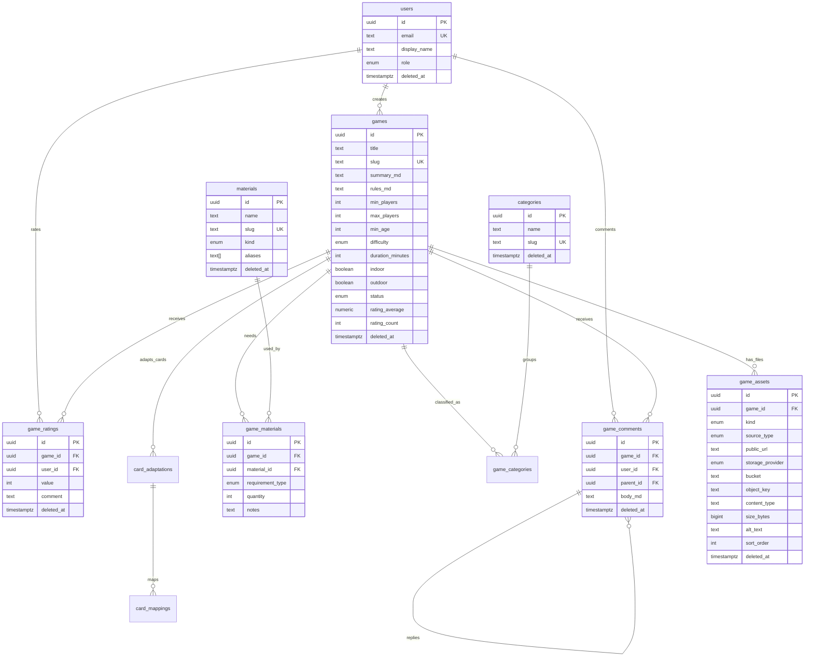

# QueJugamos ERD

Key indexes live in the TypeORM entities and include:

- `games.slug` unique.
- `games.status, difficulty, outdoor, min_age`.
- `games.min_players, max_players`.
- `materials.slug` unique.
- `game_materials.material_id, requirement_type`.
- `game_materials.game_id, material_id` unique.
- `game_assets.game_id, kind`.
- `game_ratings.game_id` and active unique `user_id, game_id`.
- `game_comments.game_id, created_at`.
